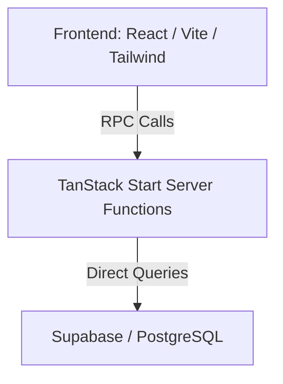

# Hero Cycles Pricing Engine - Documentation

## 1. Project Overview

**Project Name:** Cycle Pricing Pro (Hero Cycles Pricing Engine)

**Purpose:** To provide a comprehensive, intuitive cycle configuration and pricing intelligence workspace.

**Business Problem:** The system aims to eliminate Excel-based pricing management work by providing a centralized database of parts, historical/future pricing, and dynamically calculated cycle configuration prices.

**Target User:** Hero Cycles salesperson who needs to manage cycle parts, configure cycles for clients, quote prices based on active component pricing, and understand how individual part price changes impact the overall cost of various configurations.

---

## 2. Key Features

The following features have been implemented and are fully functional:

- **Parts Management:** View, create, and manage cycle components (frames, gears, tyres, brakes, saddles, etc.). Support for Active/Inactive statuses.
- **Price History:** View chronological pricing data for parts. Old prices are never overwritten.
- **Future Price Scheduling:** Set upcoming part prices with effective dates. Future prices automatically take effect based on system date.
- **Predefined Configurations:** Standard, reusable Hero Cycles configurations (e.g., "Mountain Pro", "Trail Master").
- **Custom Configurations:** User-created or modified configurations separated from the predefined base to prevent unintended systemic changes.
- **Cycle Builder:** The core experience where users can select a base configuration, add/remove components, and change quantities.
- **Live Price Calculation:** Dynamic recalculation of the cycle's total price based on the current effective part prices and quantities selected.
- **Component-wise Price Breakdown:** Clear view of individual component costs contributing to the grand total.
- **Price Impact Analysis:** Visibility into how changing a specific part's price affects the total price of all configurations utilizing that part.

*(Planned but not yet implemented: Direct PDF quote generation for clients, user authentication/authorization roles.)*

---

## 3. System Architecture

The application diverges from the initially planned Next.js/Prisma stack. The **actual implemented architecture** is as follows:

```text
React / Vite (Frontend)
   ↓
TanStack Router (Routing)
   ↓
TanStack Start Server Functions (API/RPC Layer)
   ↓
Supabase (PostgreSQL Database + Auth)
```

**Architecture Diagram:**



---

## 4. Database Design

The database is built on **PostgreSQL** (hosted via Supabase), leveraging direct SQL and migrations rather than Prisma ORM.

### Key Entities

- **`parts`**: Stores distinct components.
  - Fields: `id`, `name`, `category`, `description`, `status` (ACTIVE/INACTIVE).
- **`part_prices`**: Maintains effective-dated pricing for parts.
  - Fields: `id`, `part_id`, `price`, `effective_from`, `effective_to`, `note`.
  - Relationships: Belongs to a `part`.
  - Constraints: Overlapping price periods for the same part are rejected via PostgreSQL triggers.
- **`configurations`**: Represents a bundled cycle build.
  - Fields: `id`, `name`, `description`, `type` (PREDEFINED/CUSTOM), `derived_from_id`.
- **`configuration_items`**: Maps parts to a configuration with specific quantities.
  - Fields: `id`, `configuration_id`, `part_id`, `quantity`.
  - Relationships: Belongs to `configurations` and `parts`.

### Pricing History Design
Pricing relies on `effective_from` and `effective_to` dates. The system fetches the price whose date range encloses the current calculation date, enabling seamless historical and future pricing.

---

## 5. Pricing Engine

The pricing engine resolves prices dynamically:

- **Storage:** Prices are stored as individual rows in `part_prices` rather than overwriting a single column on the `parts` table.
- **Effective Dates:** A price is valid starting `effective_from` until `effective_to`. If `effective_to` is null, the price remains valid indefinitely.
- **Historical Prices:** Previous price records are maintained for historical reporting.
- **Future Prices:** Adding a price with an `effective_from` in the future means configurations will automatically adopt this price once that date is reached.
- **Calculation:** Configuration price = Σ (Active Part Price * Quantity).
- **Missing Prices:** The system expects every part in a configuration to have a valid price for the target date.
- **Overlap Validation:** Database-level triggers prevent creating overlapping `effective_from` and `effective_to` ranges for the same part.

---

## 6. Price Impact

The system analyzes the financial ripple effect of a part price update across all configurations using that part.

**Example Impact Flow:**
```text
Part:
Mountain Tyre

Old Price: ₹1,200
New Price: ₹1,350

Affected Configuration: Mountain Pro
Quantity of Mountain Tyre in Mountain Pro: 2

Impact Calculation: 
(₹1,350 - ₹1,200) * 2 = +₹300 Impact
```
*UI representation clearly marks price increases in Coral/Peach indicators for quick salesperson comprehension.*

---

## 7. UI Documentation

The user interface follows a modern, premium design language centered around `Deep Teal`, `Mustard/Gold`, and `Coral`.

Implemented Screens:

- **Dashboard (`/`)**: High-level overview of pricing pulse and quick actions.
- **Cycle Builder (`/cycle-builder`)**: 
  - **Purpose:** Core configuration tool.
  - **Functionality:** Select a predefined base, add/remove components, alter quantities, and observe live price updates.
  - **Interactions:** "Customize" button spins off a `CUSTOM` configuration to prevent accidental modification of `PREDEFINED` setups.
- **Configurations (`/configurations`)**: 
  - **Purpose:** List view of all saved cycle builds.
  - **Functionality:** View aggregated costs, search, and filter.
- **Parts (`/parts`)**: 
  - **Purpose:** Inventory reference.
  - **Functionality:** View active/inactive status and current effective price.
- **Price History (`/parts/:id`)**: 
  - **Purpose:** Drill-down into a specific part's price timeline.
  - **Functionality:** Add new future/historical prices, ensuring no overlap.
- **Price Impact (`/price-impact`)**: 
  - **Purpose:** Analyze cost changes.
  - **Functionality:** Select a part and see exactly which configurations are affected and by how much.

---

## 8. API Documentation

Endpoints are implemented as TanStack Start Server Functions. They are invoked as RPCs rather than standard REST URLs.

- `listPartsFn` (GET): Retrieves all parts with their currently effective price.
- `getPartFn` (GET): Retrieves part details and its complete price history.
- `createPartFn` (POST): Creates a new component.
- `setPartStatusFn` (POST): Toggles ACTIVE/INACTIVE state.
- `addPartPriceFn` (POST): Adds a new price record (validates overlaps).
- `listConfigurationsFn` (GET): Retrieves predefined and custom builds.
- `getConfigurationFn` (GET): Retrieves items, quantities, and individual prices for a specific build.
- `calculateBreakdownFn` (POST): Calculates dynamic pricing for an arbitrary list of components and quantities (used by Cycle Builder).
- `saveConfigurationFn` (POST): Persists a new or customized build to the database.
- `deleteConfigurationFn` (POST): Removes a custom configuration.
- `listPriceChangesFn` (GET): Identifies recent part price changes.
- `getPriceImpactFn` (GET): Calculates configuration impact for a specified part and price delta.

---

## 9. Project Structure

```text
/
├── .env                    # Environment variables
├── package.json            # Vite, React, TanStack dependencies
├── vite.config.ts          # Vite configuration
├── supabase/               # Database definitions
│   ├── migrations/         # PostgreSQL schema and seeded data
│   └── config.toml
└── src/                    # Source code
    ├── components/         # Reusable UI components (Tailwind/Radix UI)
    ├── hooks/              # Custom React hooks
    ├── lib/                # Utilities and Server Functions (pricing.functions.ts)
    └── routes/             # TanStack Router page components
```

---

## 10. Installation & Setup

**Requirements:**
- Node.js (v18+)
- Supabase account/CLI for database hosting

**1. Install Dependencies**
```bash
npm install
```

**2. Environment Variables**
Create a `.env` file referencing your Supabase project:
```env
SUPABASE_PROJECT_ID="your_project_id"
SUPABASE_PUBLISHABLE_KEY="your_publishable_key"
SUPABASE_URL="your_supabase_url"
VITE_SUPABASE_PROJECT_ID="your_project_id"
VITE_SUPABASE_PUBLISHABLE_KEY="your_publishable_key"
VITE_SUPABASE_URL="your_supabase_url"
```

**3. Database Setup**
The database schema and initial seed data are managed via Supabase migrations.
If running local Supabase:
```bash
npx supabase start
npx supabase migration up
```
Or, execute the SQL found in `supabase/migrations/20260818093854_e963b386-f730-46e1-95b7-a3e09456bfec.sql` against your hosted Postgres instance.

**4. Development Server**
```bash
npm run dev
```
*(The application runs on the port designated by Vite, typically `localhost:5173` unless otherwise occupied).*

**5. Production Build**
```bash
npm run build
```

---

## 11. Testing

**Manual Test Scenarios (Critical Paths):**
1. **Part Creation & Price Update:** Create a part, add a price for today, then add a future price for next month. Ensure no overlap errors occur unless ranges intersect.
2. **Configuration Customization:** Open "Mountain Pro", hit "Customize", modify quantity of "Mountain Tyre" to 3. Save it. Verify "Mountain Pro" remains untouched and a new Custom configuration appears.
3. **Price Impact Verification:** Increase the price of "Mountain Tyre". Navigate to `/price-impact`, verify the calculation correctly multiplies the price difference by the quantity (2) for the Mountain Pro configuration.

---

## 12. Troubleshooting

- **Overlapping Price Period Error:** If you encounter `OVERLAPPING_PRICE_PERIOD` when adding a price, check the part's price history. Ensure the `effective_from` date doesn't fall within an existing price's validity range.
- **Prices not updating in Cycle Builder:** Verify that the system date falls within the `effective_from` and `effective_to` bounds of the newly created price.
- **Missing Environment Variables:** If API calls fail immediately upon load, ensure `.env` is populated with `VITE_SUPABASE_URL` and `VITE_SUPABASE_PUBLISHABLE_KEY`.

---

## 13. Future Improvements

*(Planned but not implemented)*
- Export/Print configurations as PDF Quotations for customers.
- User Authentication and role-based access control (Admin vs. Sales).
- Margin and Profitability tracking per component.
- Bulk import tool for vendor price lists.
