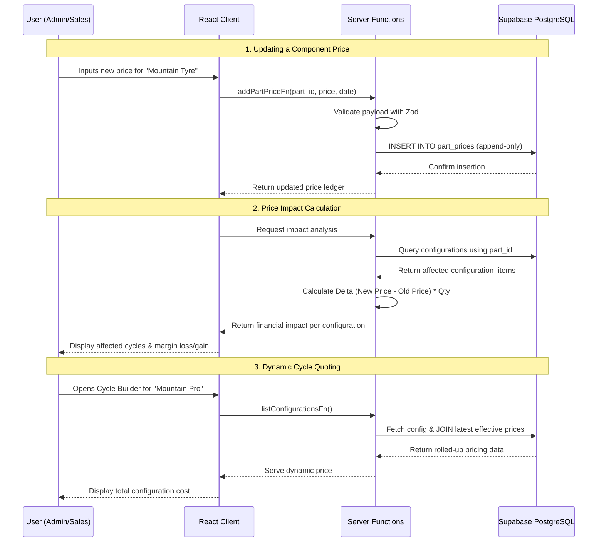

# VeloRate — Cycle Pricing Engine

VeloRate is a robust, dynamic pricing engine and quoting application engineered specifically for the cycle manufacturing and retail industry.

## 1. Project Overview

**Problem Addressed:**  
Sales and pricing teams typically rely on static, disconnected spreadsheets to calculate the cost of complex product configurations (like bicycles). When the base cost of a single component (e.g., a suspension fork) changes, it is incredibly difficult to accurately track the margin impact across dozens of different bicycle models that use that part. Additionally, losing the historical pricing context for components makes it impossible to audit past quotes.

**Primary Purpose & Use Case:**  
VeloRate serves as a single source of truth for component pricing and cycle configurations. It empowers sales representatives and pricing administrators to dynamically build quotes, manage append-only part pricing histories, and instantly visualize the margin impact of cost fluctuations across all affected cycle configurations.

## 2. Solution Provided

VeloRate eliminates Excel-based workflows by providing a highly reactive, centralized pricing workspace.

**Key Capabilities & Implementation Approach:**
* **Dynamic Price Rollup:** Instead of storing static prices for cycle configurations, VeloRate calculates prices on the fly. It fetches the most recent effective part prices and rolls up the total cost based on the components and quantities in a specific configuration.
* **Historical Pricing Ledger:** Component prices are stored in an append-only ledger (`part_prices`). Instead of overwriting a part's cost, new prices are appended with an `effective_date`, preserving the full historical audit trail.
* **Instant Price Impact Analysis:** When a part's cost changes, the system calculates the delta and immediately identifies every cycle configuration that utilizes that part, calculating the exact financial impact on the overall configuration margin.
* **Interactive Cycle Builder:** A specialized workspace for salespeople to select base cycle models, tweak component quantities, and see client-side price updates instantly without hard page reloads.

## 3. System Architecture

The application is built on a modern serverless edge architecture, utilizing TanStack Start for seamless Server-Side Rendering (SSR) and Remote Procedure Calls (RPC).


### Component Responsibilities

1. **Web Browser (Frontend):** React 19 powered by TanStack Router. Handles client-side state for the Cycle Builder, ensuring UI interactions (like changing part quantities) are instantly reflected without network latency.
2. **SSR / Nitro Engine (Backend):** Vercel's Edge/Serverless runtime (Nitro) powers the initial server-side rendering of the application, ensuring fast time-to-interactive and secure environment variable handling.
3. **Server Functions (RPC):** TanStack Start Server Functions act as the API layer. Instead of traditional REST endpoints, these type-safe functions validate payloads using Zod and execute secure queries against the database.
4. **Supabase (Database):** A managed PostgreSQL instance that holds the normalized relational data model (parts, price ledgers, configurations, and junction tables).

## 4. Project Flow

The following describes the end-to-end data flow when a pricing administrator updates a component cost and a salesperson reviews the impact.



### Step-by-Step Flow

1. **Price Initialization:** The user selects a component in the UI and sets a new price.
2. **Secure RPC Call:** The client triggers a TanStack Server Function (`addPartPriceFn`).
3. **Data Validation:** The server function uses Zod to validate the payload types and business rules.
4. **Database Insertion:** The server function securely connects to Supabase and inserts a new row into the `part_prices` ledger with the current effective date.
5. **Impact Calculation:** The UI requests the price impact. The server queries the `configuration_items` junction table to find all cycles using the modified part, calculates the delta, and returns the financial impact.
6. **Quote Assembly:** A salesperson opens the Cycle Builder. The system queries the configuration, joins it with the *latest* effective prices from the ledger, and rolls up the final cost for the user.

## 5. Tech Stack

* **Framework:** TanStack Start (Full-stack React framework)
* **Routing:** TanStack Router
* **Frontend:** React 19, Tailwind CSS
* **Build Tool:** Vite
* **Backend/Server:** Nitro (Vercel Edge/Serverless)
* **Database:** Supabase (PostgreSQL)
* **Validation:** Zod

## 6. Database Design

VeloRate relies on a strictly normalized schema to preserve historical data integrity.

* `parts`: Core component catalog (`id`, `sku`, `name`, `category`, `status`).
* `part_prices`: Append-only historical price ledger (`id`, `part_id`, `price`, `effective_date`).
* `configurations`: Base cycle models (`id`, `name`, `base_price`).
* `configuration_items`: N:M junction table mapping parts to configurations and their quantities (`id`, `configuration_id`, `part_id`, `quantity`).

## 7. Development Setup

### Prerequisites
* Node.js (v18 or higher)
* npm or bun
* A Supabase project

### Installation

1. Clone the repository:
   ```bash
   git clone https://github.com/Akbarali-Nagalpara/VeloRate.git
   cd VeloRate
   ```

2. Install dependencies:
   ```bash
   npm install
   ```

3. Configure Environment Variables:
   Create a `.env` file in the root directory and add your Supabase credentials:
   ```env
   VITE_SUPABASE_URL=your_supabase_url
   VITE_SUPABASE_ANON_KEY=your_anon_key
   SUPABASE_SERVICE_ROLE_KEY=your_service_role_key
   ```

4. Start the development server:
   ```bash
   npm run dev
   ```

5. Build for production:
   ```bash
   npm run build
   ```

## 8. License

This project is proprietary and confidential. Unauthorized copying, distribution, or modification of this repository is strictly prohibited.
